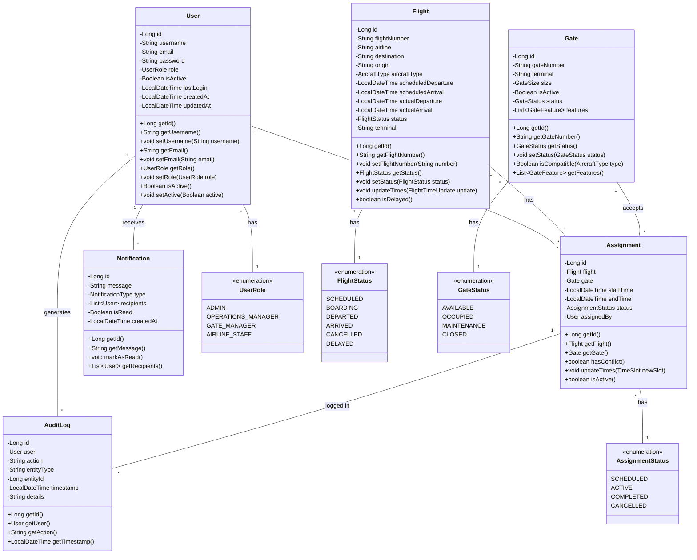

# Airport Gate Management System - Design Report
## CST-339: Programming in Java III

**Topic:** Topic 1 - Introduction to Spring Boot  
**Date:** January 11, 2025  
**Revision:** 1.0  
**Team:** Owen Lindsey  
**GIT URL:** 

## Domain Overview

The Airport Gate Management System (AGMS) addresses the complex challenges faced by modern airports in managing their gate assignments and flight operations. Currently, many airports rely on manual processes or outdated systems that don't provide real-time updates, leading to inefficiencies in gate utilization and potential delays in flight operations. Our system aims to streamline these operations through an intuitive, web-based interface that provides real-time management of gates, flights, and resources.

## User Stories and Requirements

### Public/Customer Access

As an airline passenger or airport visitor, I need to quickly find my flight and gate information to ensure I arrive at the right location on time:
```
"I need to easily look up my flight by flight number or destination to find the correct terminal and gate. I should be able to see real-time updates about my flight's status, gate changes, and boarding times. The information should be clear and accessible from both mobile and desktop devices, with the option to receive notifications about changes affecting my flight."
```
Key Requirements:
- Simple, intuitive flight search
- Clear gate and terminal information
- Real-time flight status updates
- Mobile-responsive design
- Gate location wayfinding
- Boarding time information
- Gate change notifications
- ADA-compliant interface

This public interface will be separate from the administrative system but will consume data from the same backend services. The focus is on providing clear, accurate information without the complexity of the full management system.

### Airport Operations Staff

As an airport operations manager, I need to efficiently manage gate assignments so that I can maximize airport resource utilization and minimize delays. This includes:
```
"I need to see a real-time dashboard of all gate assignments and their current status. When a flight is delayed, I need to be able to quickly identify available gates and reassign flights to minimize disruption to the overall schedule. The system should automatically check for conflicts and alert me before I make an invalid assignment."
```
***Key Requirements:***
- Real-time visibility of gate status
- Drag-and-drop interface for quick reassignments
- Automatic conflict detection
- Historical assignment data for planning

### Gate Managers

As a gate manager, I need to monitor and update the status of gates under my responsibility to ensure smooth operations. Their story:
```
"I need to be able to quickly mark gates as available, occupied, or under maintenance. When maintenance is scheduled, I need to block out that time in advance so no flights get assigned to that gate. I also need to record any issues or special conditions that might affect gate usage."
```
Key Requirements:
- Quick status updates
- Maintenance scheduling
- Issue reporting
- Gate history tracking

### Airline Staff

As an airline staff member, I need to view gate assignments for my airline's flights and request changes when necessary:
```
"I need to see all upcoming gate assignments for my airline's flights. When operational requirements change, I need to be able to request gate reassignments and receive quick approval or denial from airport operations. I also need to be notified immediately of any changes affecting our flights."
```
Key Requirements:
- Airline-specific view of assignments
- Gate change request system
- Real-time notifications
- Historical data access

## Technical Architecture

### Data Model Description

Our system's data model is designed to capture the complex relationships between flights, gates, and assignments while maintaining data integrity and supporting efficient queries.

The User represents system users with different roles and permissions. Each user has:
- A unique identifier
- Authentication credentials
- Role assignments
- Audit information including creation and last update timestamps
- Session management data

The Flight captures all necessary flight information:
- Flight number with airline code
- Scheduled arrival and departure times
- Aircraft type and size requirements
- Current status and any delay information
- Gate assignment history

The Gate maintains detailed information about each gate:
- Unique gate identifier
- Terminal location
- Size and aircraft type compatibility
- Current status and availability
- Maintenance history and scheduled maintenance

The Assignment manages the relationship between flights and gates:
- Time period for the assignment
- Assignment status and history
- Conflict checking data
- Created by and last modified information

### Business Logic Layer

The business layer implements complex rules for gate assignments, including:

Aircraft Compatibility Verification:
```java
public interface GateCompatibilityService {
    /**
     * Verifies if a gate can accommodate a specific aircraft type
     * considering physical dimensions and service requirements.
     *
     * @param gate The gate to verify
     * @param aircraftType The type of aircraft to check
     * @return A compatibility result with details
     */
    CompatibilityResult verifyCompatibility(Gate gate, AircraftType aircraftType);
}
```

Conflict Detection:
```java
public interface ConflictDetectionService {
    /**
     * Analyzes potential conflicts for a proposed gate assignment
     * considering existing assignments and maintenance schedules.
     *
     * @param proposedAssignment The assignment to verify
     * @return List of detected conflicts with details
     */
    List<Conflict> detectConflicts(Assignment proposedAssignment);
}
```

### User Roles and Permissions

| Feature/Action | Admin | Operations Manager | Gate Manager | Airline Staff | Public |
|----------------|-------|-------------------|--------------|---------------|---------|
| View Public Flight Info | ✓ | ✓ | ✓ | ✓ | ✓ |
| View Public Gate Info | ✓ | ✓ | ✓ | ✓ | ✓ |
| Search Flights | ✓ | ✓ | ✓ | ✓ | ✓ |
| View Admin Dashboard | ✓ | ✓ | ✓ | ✓ | - |
| View Detailed Reports | ✓ | ✓ | ✓ | ✓ | - |
| Generate Reports | ✓ | ✓ | ✓ | ✓ | - |
| Create Assignments | ✓ | ✓ | - | - | - |
| Modify Assignments | ✓ | ✓ | - | - | - |
| Delete Assignments | ✓ | ✓ | - | - | - |
| Manage Gates | ✓ | ✓ | ✓ | - | - |
| Manage Flights | ✓ | ✓ | - | ✓ | - |
| User Management | ✓ | - | - | - | - |
| System Settings | ✓ | - | - | - | - |
| View Audit Logs | ✓ | ✓ | - | - | - |

## System Architecture and Design

### Class Diagram (UML)
The following class diagram illustrates the core components of the system and their relationships:



### Application Sitemap
[To be created in draw.io]

The sitemap will illustrate the complete navigation structure of both the public and administrative interfaces, showing:
- Hierarchical page organization
- User flow paths
- Access restrictions
- Integration points

### Wireframe Designs
[To be created in draw.io]

#### Public Interface Wireframes
The following screens will be designed:
1. Flight Search Page
2. Flight Details View
3. Gate Information Display
4. Real-time Status Board

#### Administrative Interface Wireframes
The following screens will be designed:
1. Dashboard
2. Gate Management Interface
3. Flight Management Screen
4. Assignment Creation/Edit
5. Reports Interface

***Note:*** Wireframes will be created in draw.io and will include:
- Layout structure
- Component placement
- Navigation elements
- Key functionality indicators
- Data display formats
- Interactive elements
- Mobile responsive considerations

The user interface is designed to provide immediate access to critical information while maintaining simplicity and usability. Each screen is crafted to support specific user stories and workflows.

***Dashboard View Description:***
The main dashboard provides an immediate overview of airport operations. The layout is divided into three main sections:

***Top Section:***
- User information and quick actions
- System-wide alerts and notifications
- Quick search functionality

***Middle Section:***
- Interactive gate map showing current status
- Timeline view of upcoming assignments
- Real-time flight status updates

***Bottom Section:***
- Recent activity log
- Performance metrics
- Quick access to common tasks

***The interface uses color coding to indicate status:***
- Green: Available/On Time
- Yellow: Warning/Potential Conflict
- Red: Unavailable/Critical Issue
- Blue: In Use/Normal Operation

## Implementation Strategy

### Feature Priority and Timeline

| Feature | Priority | Complexity | Dependencies | Timeline | Status |
|---------|----------|------------|--------------|----------|---------|
| User Authentication | P0 | Medium | None | Week 1-2 | Not Started |
| Database Setup | P0 | High | None | Week 1-2 | Not Started |
| Gate Management | P1 | Medium | Database | Week 3-4 | Not Started |
| Flight Management | P1 | Medium | Database | Week 3-4 | Not Started |
| Assignment System | P1 | High | Gates, Flights | Week 5-6 | Not Started |
| Real-time Updates | P2 | High | Assignment System | Week 7-8 | Not Started |
| Reporting | P2 | Medium | All Core Features | Week 9-10 | Not Started |
| API Integration | P3 | Medium | All Features | Week 11-12 | Not Started |

### Development Phases

#### Phase 1: Core Infrastructure (Weeks 1-4)

| Component | Description | Deliverables | Validation Criteria |
|-----------|-------------|--------------|-------------------|
| Spring Boot Setup | Basic application configuration | - Project structure\n- Security framework\n- Basic endpoints | - Application runs\n- Endpoints respond\n- Security works |
| Database Design | Initial schema and migrations | - Schema design\n- Migration scripts\n- Base repositories | - Schema validates\n- Migrations run\n- CRUD works |
| Authentication | User management and security | - Login system\n- Role management\n- User interfaces | - Users can login\n- Roles work\n- Interface functions |

### Phase 2: Business Logic Implementation

The second phase implements core business functionality:

1. Gate Management
   - Implement gate CRUD operations
   - Create gate status management
   - Set up maintenance scheduling

2. Flight Management
   - Implement flight CRUD operations
   - Create flight status tracking
   - Set up real-time updates

3. Assignment Management
   - Implement assignment algorithms
   - Create conflict detection
   - Set up notification system

### Phase 3: Interface and Integration

The final phase focuses on user interface and system integration:

1. User Interface Development
   - Create responsive dashboard
   - Implement interactive gate map
   - Develop reporting interfaces

2. System Integration
   - Implement real-time updates
   - Create API endpoints
   - Set up external system interfaces

## Risk Management

Our risk management strategy focuses on identifying, assessing, and mitigating potential issues before they impact development or operations.

Technical Risks:

Real-time Data Synchronization:
The system requires real-time updates across multiple users and interfaces. To mitigate this risk, we will:
- Implement WebSocket connections for live updates
- Use optimistic locking for concurrent modifications
- Implement a robust caching strategy
- Create fallback mechanisms for offline operation

Database Performance:
With multiple users and frequent updates, database performance is crucial. Our mitigation strategy includes:
- Implementing proper indexing strategies
- Using caching where appropriate
- Regular performance monitoring
- Query optimization

Security Concerns:
Given the sensitive nature of airport operations, security is paramount. We will:
- Implement comprehensive authentication
- Regular security audits
- Encrypted data transmission
- Detailed audit logging

## Testing Strategy

Our testing approach ensures comprehensive coverage across all system components:

Unit Testing:
- Service layer tests
- Repository layer tests
- Utility class tests
- Controller tests

Integration Testing:
- API endpoint tests
- Database interaction tests
- Security integration tests
- WebSocket functionality tests

End-to-End Testing:
- User workflow tests
- Performance tests
- Security penetration tests
- Browser compatibility tests

## Success Criteria

The project's success will be measured against these specific criteria:

1. Functional Requirements
   - All CRUD operations working correctly
   - Real-time updates functioning
   - Conflict detection operating accurately
   - Report generation working properly

2. Performance Requirements
   - Page load times under 2 seconds
   - Real-time updates within 500ms
   - Search results returned within 1 second
   - Report generation under 5 seconds

3. Quality Requirements
   - Test coverage above 80%
   - No critical security vulnerabilities
   - All major browsers supported
   - Mobile responsiveness achieved
