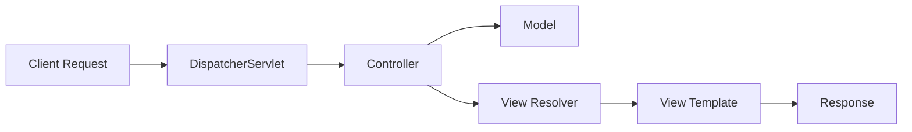

# Spring MVC Implementation Documentation

## Part 1: Creating Models, Views, and Controllers
### Controller Implementation Screenshots
We have successfully implemented the HelloWorldController with various endpoints demonstrating different Spring MVC concepts. Here are the implementation results:

#### Basic Route Response (/hello/test1)

This endpoint demonstrates a direct text response using @ResponseBody, displaying "Hello World! - Owen" when accessed at localhost:8080/hello/test1.

#### Template View Response (/hello/test2)

The template-based view implementation shows "Hello Spring MVC Framework! - Owen" with navigation links to other test endpoints. This demonstrates successful integration of Thymeleaf templating.

#### ModelAndView Implementation (/hello/test3)

This endpoint showcases the ModelAndView approach, successfully displaying two messages:
- "Hello World from ModelAndView!"
- "Another Hello World from ModelAndView!"

#### Request Parameter Handling (/hello/test4)

The parameter handling implementation correctly displays the message "Owen!" when accessed through localhost:8080/hello/test4?message=Owen!, demonstrating successful URL parameter processing.

### Code Implementation
The implementation includes properly structured controllers and templates:
1. HelloWorldController with mappings for all test endpoints
2. HomeController configured for root URL handling
3. Thymeleaf templates with proper navigation between endpoints

All endpoints demonstrate working functionality with proper navigation links between test routes, fulfilling the assignment requirements for creating and implementing Spring MVC controllers, models, and views.

## Part 2: Forms and Data Validation
### Login Form Implementation
We have successfully implemented form handling and data validation using Spring MVC and JSR-303 validation framework.

#### Initial Login Form

The initial implementation shows a clean login form with username and password fields, demonstrating proper form structure and Thymeleaf integration.

#### Console Output Verification

The console output confirms successful form submission and data handling, showing the captured username and password values.

#### Validation Implementation

The form validation implementation successfully displays error messages when validation rules are violated, showing:
- Field-level error messages for username and password
- Proper error styling and placement
- Clear user feedback for validation failures

### Orders Display Implementation
The orders view successfully displays the submitted data in a structured table format, showing:
- Order numbers
- Product names
- Prices
- Quantities

## Part 3: Thymeleaf Layouts
### Layout Implementation Screenshots

#### Login Page with Layout

The login page demonstrates successful implementation of the common layout, featuring:
- Consistent header with GCU logo
- Navigation bar
- Centered content
- Standardized footer

#### Orders Page with Layout

The orders page shows the same layout consistency, including:
- Proper template inheritance
- Consistent styling
- Maintained functionality within the layout framework

### Layout Features
The implementation includes:
1. Common header and footer fragments
2. Bootstrap integration for responsive design
3. Proper template inheritance structure
4. Consistent navigation across pages

## Research Questions

### Question 1: How does Spring MVC support the MVC design pattern? Draw a diagram that supports the answer to this question.

**Answer:**

Spring MVC implements the Model-View-Controller pattern through a comprehensive framework that separates concerns while maintaining tight integration:

**Controller Layer**:
- Handles HTTP requests through annotated classes (@Controller)
- Processes user input and manages application flow
- Coordinates between Model and View layers

**Model Layer**:
- Represents business data and logic
- Maintains application state
- Implements validation rules and business constraints

**View Layer**:
- Renders the user interface using Thymeleaf templates
- Displays data from the Model
- Handles user interaction elements

Here's a diagram illustrating the flow:

### Question 2: Research and identify 2 MVC Frameworks other than Spring MVC. What are the frameworks and how do they differ from Spring MVC?

**Answer:**

**Django (Python)**:
- Different from Spring MVC in:
  - Python-based instead of Java
  - More opinionated about project structure
  - Includes built-in admin interface
  - Tighter coupling between components

**ASP.NET MVC (C#)**:
- Different from Spring MVC in:
  - Windows-centric deployment
  - Closer integration with Visual Studio IDE
  - Different view engine (Razor)
  - More reliance on Microsoft ecosystem
