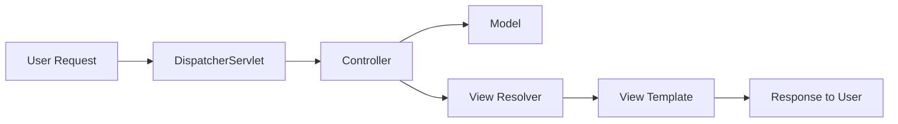

# Spring MVC Implementation Documentation

## Part 1: Creating Models, Views, and Controllers

Throughout this project, I developed several web pages to demonstrate different ways Spring MVC can handle user requests and display information. Let me walk you through each component and what it accomplishes.

### Basic Response Page
My first test page at `/hello/test1` demonstrates the simplest way to send information to a browser. When users visit this page, they see a straightforward greeting: "Hello World! - Owen". This helps show how Spring MVC can communicate directly with web browsers.

### Template-Based Pages
Moving on to more advanced features, I created a second page at `/hello/test2` that uses templates. This page displays "Hello Spring MVC Framework! - Owen" and includes navigation links, showing how templates make our pages both more functional and user-friendly.

The third page at `/hello/test3` takes this a step further by showing multiple messages at once. It displays both "Hello World from ModelAndView!" and "Another Hello World from ModelAndView!" on the same page, demonstrating how we can present several pieces of information together.

### Interactive Features
My fourth test page at `/hello/test4` introduces user interaction. When someone adds text to the web address (like localhost:8080/hello/test4?message=Owen!), the page responds by showing that text. This shows how our pages can respond to user input and create dynamic content.

### Behind the Scenes
To make all these pages work together smoothly, I created several key components:

| Component | What It Does | Why It Matters |
|-----------|--------------|----------------|
| Main Controller | Directs user requests to the right place | Ensures users get the content they're looking for |
| Homepage Controller | Creates a welcoming first page | Gives users a starting point for navigation |
| Page Templates | Provides a consistent look across pages | Makes the site feel professional and cohesive |

## Part 2: Forms and Data Validation

This section focuses on collecting and validating user information through web forms. I created a system that not only accepts user input but also helps ensure the information is correct and complete.

### The Login Experience
When users first arrive at the login page, they see a clean, straightforward form:

After they submit their information, the system processes their input and confirms it received their data:

### Making Sure Data Is Valid
The form includes features to help users enter correct information on their first try. When something needs fixing, users see clear messages explaining what went wrong:

These error messages appear right where users need them – next to the fields that need attention. The system uses everyday language to explain problems and suggest solutions, making it easy for users to correct their entries.

### Managing Orders
The orders section organizes information in an easy-to-read format:

| What We Track | How We Show It | Why It's Important |
|---------------|----------------|-------------------|
| Order Numbers | Clear IDs | Helps track each purchase |
| Product Info | Descriptive Text | Tells us what was ordered |
| Pricing | Dollar Amount | Tracks costs accurately |
| Amount Ordered | Numbers | Keeps inventory current |

## Part 3: Page Layouts

### Creating a Consistent Look
Every page in the system shares common design elements that make navigation intuitive and familiar. The layout starts with a header containing our logo and main menu. Below that, each page has its own content area that adapts based on what we're showing – whether it's a form, table, or other information.

Here's how it looks in practice:

Login Page Example:

Orders Page Example:

The layout system brings together several technologies to create a seamless experience:

| Part of the System | Technology Used | What It Accomplishes |
|-------------------|-----------------|---------------------|
| Page Header & Footer | Thymeleaf Pieces | Keeps branding consistent |
| Screen Adaptation | Bootstrap Framework | Works well on all devices |
| Site Navigation | Spring Routing | Makes moving between pages easy |
| Page Structure | Thymeleaf Templates | Maintains consistent design |

## Research Questions

### Question 1: How does Spring MVC support the MVC design pattern? Draw a diagram that supports the answer to this question.

Spring MVC creates web applications by dividing responsibilities among three main parts that work together seamlessly. Think of it like a busy airport terminal: The Controller is like the air traffic control tower, coordinating all incoming and outgoing traffic and making sure everything gets to where it needs to go. The Model is like the behind-the-scenes operations - baggage handling systems, security protocols, and flight databases - processing information and maintaining the status of every flight and passenger. The View is like the terminal displays and announcement systems that travelers interact with - departure boards, gate information screens, and check-in kiosks that present information in a way that makes sense to passengers. Just as air traffic control coordinates between ground operations and passenger information systems, the Controller in Spring MVC manages the flow of information between the Model's data processing and the View's user interface.

Here's how information flows through the system:

### Question 2: Research and identify 2 MVC Frameworks other than Spring MVC. What are the frameworks and how do they differ from Spring MVC?

Two other popular ways to build web applications are Django and ASP.NET MVC. Each takes a unique approach to solving similar problems.

Django, written in Python, comes with more built-in features than Spring MVC. Imagine getting a fully furnished house instead of an empty one – Django gives you more to start with, including an administrative interface ready to use. It has stronger opinions about how you should organize your code, which can make projects more consistent but sometimes less flexible.

ASP.NET MVC is Microsoft's approach to web development. It's deeply connected with Windows and the Visual Studio development environment, much like having a house that's specifically designed for a particular neighborhood. It uses its own view system called Razor instead of Thymeleaf, and it works especially well with other Microsoft tools. While this creates a powerful ecosystem, it might limit where and how you can deploy your application compared to Spring MVC's more adaptable nature.